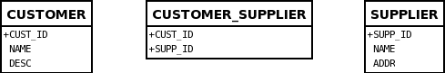

# Many-to-Many

The prerequisite is that you need the DataNucleus Maven2 plugin installed. You can download this plugin from the DataNucleus downloads area.

* Set the database configuration in "src/main/resources/META-INF/persistence.xml"
* Make sure you have the JDBC driver jar specified in the "pom.xml" file
* Run the command: "mvn clean compile". This builds everything, and enhances the classes
* Run the command: "mvn datanucleus:schema-create". This creates the schema
* Run some persistence code (to be added)
* Run the command: "mvn datanucleus:schema-delete". This deletes the schema


# Guide

This guide demonstrates an M-N collection relationship between 2 classes. In this sample we have *Supplier* and *Customer* such that each *Customer* can contain many *Supplier*s. 
In addition each *Supplier* can have many *Customer*s. We demonstrate the classes themselves, and the MetaData necessary to persist them to the datastore in the way that we require.
*In this example we use XML metadata, but you could easily use annotations*

* Classes - Design your Java classes to represent what you want to model in your system. JDO doesn't have much of an impact on this, but we'll analyse the very minor influence it does have.
* Meta-Data - Define how your objects of these classes will be persisted.
** New Database Schema - you have a clean sheet of paper and can have them persisted with no constraints.
** Existing Database Schema - you have existing tables that you need the objects persisted to.
* Managing the Relationship - How we add/remove elements to/from the M-N relation.


## The Classes">

Lets look at our initial classes for the example. We want to represent the relation between a customer and a supplier.

```
package org.datanucleus.samples.m_to_n;

public class Customer
{
    String name = null;
    String description = null;
    Collection suppliers = new HashSet();

    public Customer(String name, String desc)
    {
        this.name = name;
        this.description = desc;
    }

    public void addSupplier(Supplier supplier)
    {
        suppliers.add(supplier);
    }

    public void removeSupplier(Supplier supplier)
    {
        suppliers.remove(supplier);
    }

    public Collection getSuppliers()
    {
        return suppliers;
    }

    public int getNumberOfSuppliers()
    {
        return suppliers.size();
    }
}
```

```
public class Supplier
{
    String name = null;
    String address = null;
    Collection customers = new HashSet();

    public Supplier(String name, String address)
    {
        this.name = name;
        this.address = address;
    }

    public String getName()
    {
        return name;
    }

    public String getAddress()
    {
        return address;
    }

    public void addCustomer(Customer customer)
    {
        customers.add(customer);
    }

    public void removeCustomer(Customer customer)
    {
        customers.remove(customer);
    }

    public Collection getCustomers()
    {
        return customerers;
    }

    public int getNumberOfCustomers()
    {
        return customers.size();
    }
}
```

The first thing that we need to do is add a default constructor. This is a requirement of JDO. 
In our case we are using the DataNucleus enhancer and this will automatically add the default constructor when not present, so we omit this.

In this example we don't care about the "identity" type chosen so we will use *datastore-identity*. 
Please refer to the documentation for examples of _application_ and _datastore_ identity for how to specify them.


## MetaData for New Schema">

Now that we've decided on our classes and how we want to define their identities we can decide on the precise persistence definition. 
In this section we'll describe how to persist these objects to a new database schema where we can create new tables and don't need to write to some existing table.

Some JDO tools provide an IDE to generate Meta-Data files, but DataNucleus doesn't currently.
Either way it is a good idea to become familiar with the structure of these files since they define how your classes are persisted. 
Lets start with the header area. You add a block like this to define that the file is JDO Meta-Data

```
<?xml version="1.0"?>
<!DOCTYPE jdo PUBLIC
    "-//Sun Microsystems, Inc.//DTD Java Data Objects Metadata 2.0//EN" 
    "http://java.sun.com/dtd/jdo_2_0.dtd">
<jdo>
```

Now let's define the persistence for our *Customer* class. We define it as follows

```
    <package name="org.datanucleus.samples.m_to_n">
        <class name="Customer" identity-type="datastore">
            <field name="name" persistence-modifier="persistent">
                <column length="100" jdbc-type="VARCHAR"/>
            </field>
            <field name="description" persistence-modifier="persistent">
                <column length="255" jdbc-type="VARCHAR"/>
            </field>
            <field name="suppliers" persistence-modifier="persistent" mapped-by="customers">
                <collection element-type="org.datanucleus.samples.m_to_n.Supplier"/>
                <join/>
            </field>
        </class>
```

Here we've defined that our _name_ field will be persisted to a VARCHAR(100) column, our _description_ field will be persisted to a VARCHAR(255) column, 
and that our _suppliers_ field is a Collection containing *org.datanucleus.examples.m_to_n.Supplier* objects. 
In addition, it specifies that there is a _customers_ field in the *Supplier* class (the _mapped-by_ attribute) that gives the related customers for the Supplier. 
This final information is to inform DataNucleus to link the table for this class to the table for *Supplier* class. This is what is termed an **M-N** relationship.
Please refer to the [M-N relationships Guide](http://www.datanucleus.org/products/accessplatform/jdo/mapping.html#many_many_relations) for more details on this.

Now lets define the persistence for our *Supplier* class. We define it as follows

```
        <class name="Supplier" identity-type="datastore">
            <field name="name">
                <column length="100" jdbc-type="VARCHAR"/>
            </field>
            <field name="address">
                <column length="100" jdbc-type="VARCHAR"/>
            </field>
            <field name="customers">
                <collection element-type="org.datanucleus.samples.m_to_n.Supplier"/>
                <join/>
            </field>
        </class>
    </package>
```

Here we've defined that our _name_ field will be persisted to a VARCHAR(100) column, our _address_ field will be persisted to a VARCHAR(100) column.

We finally terminate the Meta-Data file with the closing tag

```
</jdo>
```


## MetaData for Existing Schema

Now that we've decided on our classes and how we want to define their identities we can decide on the precise persistence definition. 
In this section we'll describe how to persist these objects to an existing database schema where we already have some database tables from a 
previous persistence mechanism and we want to use those tables (because they have data in them).
Our existing tables are shown below.


We will take the Meta-Data that was described in the previous section (New Schema) and continue from there. To recap, here is what we arrived at

```
<?xml version="1.0"?>
<!DOCTYPE jdo PUBLIC
    "-//Sun Microsystems, Inc.//DTD Java Data Objects Metadata 2.0//EN" 
    "http://java.sun.com/dtd/jdo_2_0.dtd">
<jdo>
    <package name="org.datanucleus.samples.m_to_n">
        <class name="Customer" identity-type="datastore">
            <field name="name" persistence-modifier="persistent">
                <column length="100" jdbc-type="VARCHAR"/>
            </field>
            <field name="description" persistence-modifier="persistent">
                <column length="255" jdbc-type="VARCHAR"/>
            </field>
            <field name="suppliers" persistence-modifier="persistent" mapped-by="customers">
                <collection element-type="org.datanucleus.samples.m_to_n.Supplier"/>
                <join/>
            </field>
        </class>

        <class name="Supplier" identity-type="datastore">
            <field name="name">
                <column length="100" jdbc-type="VARCHAR"/>
            </field>
            <field name="address">
                <column length="100" jdbc-type="VARCHAR"/>
            </field>
            <field name="customers">
                <collection element-type="org.datanucleus.samples.m_to_n.Customer"/>
                <join/>
            </field>
        </class>
    </package>
</jdo>
```

The first thing we need to do is map the *Customer* class to the table that we have in our database. 
It needs to be mapped to a table called "CUSTOMER", with columns "NAME" and "DESC", and the identity column that DataNucleus uses needs to be called CUST_ID. 
We do this by changing the Meta-Data to be

```
<class name="Customer" identity-type="datastore" table="CUSTOMER">
    <datastore-identity>
        <column name="CUST_ID"/>
    </datastore-identity>
    <field name="name" persistence-modifier="persistent">
        <column name="NAME" length="100" jdbc-type="VARCHAR"/>
    </field>
    <field name="description" persistence-modifier="persistent">
        <column name="DESC" length="100" jdbc-type="VARCHAR"/>
    </field>
    <field name="suppliers" persistence-modifier="persistent" mapped-by="customers">
        <collection element-type="org.datanucleus.samples.m_to_n.Supplier"/>
        <join/>
    </field>
</class>
```

We now need to define the mapping for the join table storing the relationship information.
So we make use of the "table" attribute of _field_ to define this, and use the _join_ and _element_ subelements to define the columns of the join table. Like this

```
<class name="Customer" identity-type="datastore" table="CUSTOMER">
    <datastore-identity>
        <column name="CUST_ID"/>
    </datastore-identity>
    <field name="name" persistence-modifier="persistent">
        <column name="NAME" length="100" jdbc-type="VARCHAR"/>
    </field>
    <field name="description" persistence-modifier="persistent">
        <column name="DESC" length="100" jdbc-type="VARCHAR"/>
    </field>
    <field name="suppliers" persistence-modifier="persistent" mapped-by="customers" table="CUSTOMER_SUPPLIER">
        <collection element-type="org.datanucleus.samples.m_to_n.Supplier"/>
        <join>
            <column name="CUST_ID"/>
        </join>
        <element>
            <column name="SUPP_ID"/>
        </element>
    </field>
</class>
```

Lets now do the same for the class *Supplier*. In our database we want this to map to a table called "SUPPLIER", with columns "SUPP_ID" (identity), "NAME" and "ADDR". 
We need to do nothing more for the join table since it is shared and we have defined its table/columns above.

```
<class name="Supplier" identity-type="datastore" table="SUPPLIER">
    <datastore-identity>
        <column name="SUPP_ID"/>
    </datastore-identity>
    <field name="name">
        <column name="NAME" length="100" jdbc-type="VARCHAR"/>
    </field>
    <field name="address">
        <column name="ADDR" length="100" jdbc-type="VARCHAR"/>
    </field>
    <field name="customers">
        <collection element-type="org.datanucleus.samples.m_to_n.Customer"/>
        <join/>
    </field>
</class>
```

OK, so we've now mapped our 2 classes to their tables. This completes our job. 
The only other aspect that is likely to be met is where a column in the database is of a particular type, but we'll cover that in a different example.


## Management of the Relation

We now have our classes and the definition of persistence and we need to use our classes in the application. 
This section defines how we maintain the relation between the objects. Let's start by creating a few objects

```
PersistenceManager pm = pmf.getPersistenceManager();
Transaction tx = pm.currentTransaction();
Object[] custIds = new Object[2];
Object[] suppIds = new Object[3];
try
{
    tx.begin();
    
    Customer cust1 = new Customer("DFG Stores", "Small shop in London");
    Customer cust2 = new Customer("Kevins Cards", "Gift shop");
    
    Supplier supp1 = new Supplier("Stationery Direct", "123 The boulevard, Milton Keynes, UK");
    Supplier supp2 = new Supplier("Grocery Wholesale", "56 Jones Industrial Estate, London, UK");
    Supplier supp3 = new Supplier("Makro", "1 Parkville, Wembley, UK");
    
    pm.makePersistent(cust1);
    pm.makePersistent(cust2);
    pm.makePersistent(supp1);
    pm.makePersistent(supp2);
    pm.makePersistent(supp3);
    tx.commit();
    custIds[0] = JDOHelper.getObjectId(cust1);
    custIds[1] = JDOHelper.getObjectId(cust2);
    suppIds[0] = JDOHelper.getObjectId(supp1);
    suppIds[1] = JDOHelper.getObjectId(supp2);
    suppIds[2] = JDOHelper.getObjectId(supp3);
}
catch (Exception e)
{
    // Handle any errors
}
finally
{
    if (tx.isActive())
    {
        tx.rollback();
    }
    pm.close();
}
```

OK. We've now persisted some *Customer*s and *Supplier*s into our datastore. We now need to establish the relations.

```
PersistenceManager pm = pmf.getPersistenceManager();
Transaction tx = pm.currentTransaction();
try
{
    tx.begin();
    
    Customer cust1 = (Customer)pm.getObjectById(custIds[0]);
    Customer cust2 = (Customer)pm.getObjectById(custIds[1]);
    Supplier supp1 = (Supplier)pm.getObjectById(suppIds[0]);
    Supplier supp2 = (Supplier)pm.getObjectById(suppIds[1]);
    
    // Establish the relation customer1 uses supplier2
    cust1.addSupplier(supp2);
    supp2.addCustomer(cust1);

    // Establish the relation customer2 uses supplier1
    cust2.addSupplier(supp1);
    supp1.addCustomer(cust2);

    tx.commit();
}
catch (Exception e)
{
    // Handle any errors
}
finally
{
    if (tx.isActive())
    {
        tx.rollback();
    }
    pm.close();
}
```
You note that we set both sides of the relation.
We could have adapted the *Customer* method _addSupplier_ to add both sides of the relation (or alternatively via *Supplier* method _addCustomer_) to simplify this process.

Let's now assume that over time we want to change our relationships.

```
PersistenceManager pm = pmf.getPersistenceManager();
Transaction tx = pm.currentTransaction();
try
{
    tx.begin();

    // Retrieve the objects
    Customer cust1 = (Customer)pm.getObjectById(custIds[0]);
    Customer cust2 = (Customer)pm.getObjectById(custIds[1]);
    Supplier supp1 = (Supplier)pm.getObjectById(suppIds[0]);
    Supplier supp2 = (Supplier)pm.getObjectById(suppIds[1]);
    Supplier supp2 = (Supplier)pm.getObjectById(suppIds[1]);
    
    // Remove the relation from customer1 to supplier2, and add relation to supplier3
    cust1.removeSupplier(supp2);
    supp2.removeCustomer(cust1);
    cust1.addSupplier(supp3);
    supp3.addCustomer(cust1);

    // Add a relation customer2 uses supplier3
    cust2.addSupplier(supp3);
    supp3.addCustomer(cust2);

    tx.commit();
}
catch (Exception e)
{
    // Handle any errors
}
finally
{
    if (tx.isActive())
    {
        tx.rollback();
    }
    pm.close();
}
```

So now we have _customer1_ with a relation to _supplier3_, and we have _customer2_ with relations to _supplier1_ and _suppier3_. 
That should give enough idea of how to manage the relations. *The most important thing with any bidirectional relation is to set both sides of the relation.


