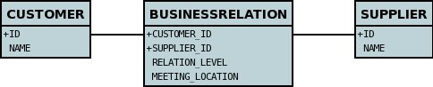

# Many-to-Many Attributed

The prerequisite is that you need the DataNucleus Maven plugin installed. You can download this plugin from the DataNucleus downloads area.

* Set the database configuration in "src/main/resources/META-INF/persistence.xml"
* Make sure you have the JDBC driver jar specified in the "pom.xml" file
* Run the command: "mvn clean compile". This builds everything, and enhances the classes
* Run the command: "mvn datanucleus:schema-create". This creates the schema
* Run some persistence code. "mvn clean exec:java"
* Run the command: "mvn datanucleus:schema-delete". This deletes the schema


# Guide 1 (Compound Identity)

DataNucleus provides support for standard JDO M-N relations where we have a relation between, for example, _Customer_ and _Supplier_, 
where a _Customer_ has many _Suppliers_ and a _Supplier_ has many _Customers_. 
A slight modification on this is where you have the relation carrying some additional attributes of the relation. Let's take some classes

```
public class Customer
{
    private long id; // PK
    private String name;
    private Set supplierRelations = new HashSet();

    ...
}
```

```
public class Supplier
{
    private long id; // PK
    private String name;
    private Set customerRelations = new HashSet();

    ...
}
```

Now we obviously can't define an "attributed relation" using Java and just these classes so we invent an intermediate "associative" class, that will also contain the attributes.

```
public class BusinessRelation
{
    private Customer customer; // PK
    private Supplier supplier; // PK
    private String relationLevel;
    private String meetingLocation;

    public BusinessRelation(Customer cust, Supplier supp, String level, String meeting)
    {
        this.customer = cust;
        this.supplier = supp;
        this.relationLevel = level;
        this.meetingLocation = meeting;
    }
    ...
}
```

So we define the metadata like this

```
<jdo>
    <package name="mydomain.business">
        <class name="Customer" detachable="true" table="CUSTOMER" objectid-class="Customer$PK">
            <field name="id" primary-key="true" value-strategy="increment" column="ID"/>
            <field name="name" column="NAME"/>
            <field name="supplierRelations" persistence-modifier="persistent" mapped-by="customer">
                <collection element-type="BusinessRelation"/>
            </field>
        </class>

        <class name="Supplier" detachable="true" table="SUPPLIER" objectid-class="Supplier$PK">
            <field name="id" primary-key="true" value-strategy="increment" column="ID"/>
            <field name="name" column="NAME"/>
            <field name="customerRelations" persistence-modifier="persistent" mapped-by="supplier">
                <collection element-type="BusinessRelation"/>
            </field>
        </class>

        <class name="BusinessRelation" type="application" detachable="true"
             objectid-class="BusinessRelation$PK" table="BUSINESSRELATION">
            <field name="customer" primary-key="true" column="CUSTOMER_ID"/>
            <field name="supplier" primary-key="true" column="SUPPLIER_ID"/>
            <field name="relationLevel" column="RELATION_LEVEL"/>
            <field name="meetingLocation" column="MEETING_LOCATION"/>
        </class>
    </package>
</jdo>
```

So we've used a 1-N "CompoundIdentity" relation between _Customer_ and _BusinessRelation_, and similarly between _Supplier_ and _BusinessRelation_ 
meaning that _BusinessRelation_ has a composite PK define like this

```
public class BusinessRelation
{
    ...

    public static class PK implements Serializable
    {
        public Customer.PK customer; // Use same name as field in class
        public Supplier.PK supplier; // Use same name as field in class

        public PK()
        {
        }

        public PK(String s)
        {
            StringTokenizer st = new StringTokenizer(s, "::");
            this.customer = new Customer.PK(st.nextToken());
            this.supplier = new Supplier.PK(st.nextToken());
        }

        public String toString()
        {
            return (customer.toString() + "::" + supplier.toString());
        }

        public int hashCode()
        {
            return customer.hashCode() ^ supplier.hashCode();
        }

        public boolean equals(Object other)
        {
            if (other != null && (other instanceof PK))
            {
                PK otherPK = (PK)other;
                return this.customer.equals(otherPK.customer) && this.supplier.equals(otherPK.supplier);
            }
            return false;
        }
    }
}
```

This arrangement will result in the following schema




So all we need to do now is persist some objects using these classes

```
PersistenceManagerFactory pmf = JDOHelper.getPersistenceManagerFactory("datanucleus.properties");
PersistenceManager pm = pmf.getPersistenceManager();
Transaction tx = pm.currentTransaction();
Object holderId = null;
try
{
    tx.begin();

    Customer cust1 = new Customer("Web design Inc");
    Supplier supp1 = new Supplier("DataNucleus Corporation");
    pm.makePersistent(cust1);
    pm.makePersistent(supp1);

    BusinessRelation rel_1_1 = new BusinessRelation(cust1, supp1, "Very Friendly", "Hilton Hotel, London");
    cust1.addRelation(rel_1_1);
    supp1.addRelation(rel_1_1);
    pm.makePersistent(rel_1_1);

    tx.commit();
}
finally
{
    if (tx.isActive())
    {
        tx.rollback();
    }
    pm.close();
}
```

This will now have persisted an entry in table "CUSTOMER", an entry in table "SUPPLIER", and an entry in table "BUSINESSRELATION". 
We can now utilise the _BusinessRelation_ objects to update the attributes of the M-N relation as we wish.


# Guide 2 (Best Practice, using Surrogate Identity)

Clearly the above example requires the definition of primary key classes, and additionally complicates the relationships.
To change this to use *best practice* you should get rid of the primary key classes, and change the intermediate _BusinessRelation_
to use datastore (surrogate) identity. This will now be simpler to understand and run more efficiently.


So we define the metadata like this

```
<jdo>
    <package name="mydomain.business">
        <class name="Customer2" detachable="true" table="CUSTOMER2">
            <field name="id" primary-key="true" value-strategy="increment" column="ID"/>
            <field name="name" column="NAME"/>
            <field name="supplierRelations" persistence-modifier="persistent" mapped-by="customer">
                <collection element-type="BusinessRelation2"/>
            </field>
        </class>

        <class name="Supplier2" detachable="true" table="SUPPLIER2">
            <field name="id" primary-key="true" value-strategy="increment" column="ID"/>
            <field name="name" column="NAME"/>
            <field name="customerRelations" persistence-modifier="persistent" mapped-by="supplier">
                <collection element-type="BusinessRelation2"/>
            </field>
        </class>

        <class name="BusinessRelation2" type="datastore" detachable="true" table="BUSINESSRELATION2">
            <field name="customer" column="CUSTOMER_ID"/>
            <field name="supplier" column="SUPPLIER_ID"/>
            <field name="relationLevel" column="RELATION_LEVEL"/>
            <field name="meetingLocation" column="MEETING_LOCATION"/>
        </class>
    </package>
</jdo>
```

The persistence code is identical, and the only change to the persistable classes is to remove the PK classes.