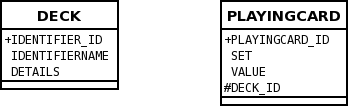

# One-to-Many Bidirectional FK

The prerequisite is that you need the DataNucleus Maven2 plugin installed. You can download this plugin from the DataNucleus downloads area.

* Set the database configuration in the "src/main/resources/META-INF/persistence.xml" file.
* Make sure you have the JDBC driver jar specified in the "pom.xml" file
* Run the command: "mvn clean compile". This builds everything, and enhances the classes


# Guide

This guide demonstrates a 1-N collection relationship between 2 classes. In this sample we have *Pack* and *Card* such that each *Pack* can contain many *Card*s. 
In addition each *Card* has a *Pack* that it belongs to. We demonstrate the classes themselves, and the MetaData necessary to persist them to the datastore in the way that we require. 
In this case we are going to persist the relation to an RDBMS using a ForeignKey.

* Design your Java classes to represent what you want to model in your system. Persistence doesn't have much of an impact on this stage, but 
we'll analyse the very minor influence it does have.
* Decide how the identities of your objects of these classes will be defined. Do you want JDO to give them id's or will you do it yourself.
* Meta-Data - Define how your objects of these classes will be persisted.
** New Database Schema - you have a clean sheet of paper and can have them persisted with no constraints.
** Existing Database Schema - you have existing tables that you need the objects persisted to.


## The Classes

Lets look at our initial classes for the example. We want to represent a pack of cards.

```
package org.datanucleus.samples.packofcards.inverse;

public class Pack
{
    String name=null;
    String description=null;

    Set    cards=new HashSet();

    public Pack(String name, String desc)
    {
        this.name = name;
        this.description = desc;
    }

    public void addCard(Card card)
    {
        cards.add(card);
    }

    public void removeCard(Card card)
    {
        cards.remove(card);
    }

    public Set getCards()
    {
        return cards;
    }

    public int getNumberOfCards()
    {
        return cards.size();
    }
}

public class Card
{
    String suit=null;
    String number=null;
    Pack   pack=null;

    public Card(String suit,String number)
    {
        this.suit = suit;
        this.number = number;
    }

    public String getSuit()
    {
        return suit;
    }

    public String getNumber()
    {
        return number;
    }

    public Pack getPack()
    {
        return pack;
    }

    public void setPack(Pack pack)
    {
        this.pack = pack;
    }

    public String toString()
    {
        return "The " + number + " of " + suit;
    }
}
```

The first thing that we need to do is add a default constructor. This is a requirement of JDO. This can be private if we wish, so we add

```
public class Pack
{
    private Pack()
    {
    }

    ...
}
public class Card
{
    private Card()
    {
    }

    ...
}
```

## Object Identity

The next thing to do is decide if we want to allow DataNucleus to generate the identities of our objects, or whether we want to do it ourselves. 
In our case we will allow DataNucleus to create the identities for our *Pack*s and also for our *Card*s.


In the case of *Pack* there is nothing more to code since DataNucleus will handle the identities. Similarly, in the case of *Card* there is nothing more to add.

## MetaData for New Schema

Now that we've decided on our classes and how we want to define their identities we can decide on 
the precise persistence definition in the datastore. In this section we'll describe how to persist 
these objects to a new database schema where we can create new tables and don't need to write to some existing table.

Some JDO tools provide an IDE to generate Meta-Data files, but DataNucleus doesn't currently. Either way 
it is a good idea to become familiar with the structure of these files since they define how your 
classes are persisted. Lets start with the header area. You add a block like this to define that the file is JDO Meta-Data

```
<?xml version="1.0"?>
<!DOCTYPE jdo PUBLIC
    "-//Sun Microsystems, Inc.//DTD Java Data Objects Metadata 2.0//EN" 
    "http://java.sun.com/dtd/jdo_2_0.dtd">
<jdo>
```


Now let's define the persistence for our *Pack* class. We are going to use *datastore identity* here, meaning that DataNucleus will assign id's to each *Pack* object 
persisted. We define it as follows

```
    <package name="org.datanucleus.samples.packofcards.inverse">
        <class name="Pack" identity-type="datastore">
            <field name="name" persistence-modifier="persistent">
                <column length="100" jdbc-type="VARCHAR"/>
            </field>
            <field name="description" persistence-modifier="persistent">
                <column length="100" jdbc-type="VARCHAR"/>
            </field>
            <field name="cards" persistence-modifier="persistent" mapped-by="pack">
                <collection element-type="org.datanucleus.samples.packofcards.inverse.Card">
                </collection>
            </field>
        </class>
```

Here we've defined that our _name_ field will be persisted to a VARCHAR(100) column, our _description_ field will be persisted to a VARCHAR(255) column, and that our _cards_ 
field is a Collection containing *org.datanucleus.examples.packofcards.inverse.Card* objects. 
In addition, it specifies that there is a _pack_ field in the *Card* class (the _mapped-by_ attribute) that gives the related pack (with the *Pack* being the owner of the relationship). 
This final information is to inform DataNucleus to link the table for this class (via a foreign key) to the table for *Card* class. 
This is what is termed a **ForeignKey** relationship. 
Please refer to the [1-N Relation Guide](http://www.datanucleus.org/products/accessplatform/jdo/mapping.html#one_many_relations) for more details on this. 
We'll discuss **join table** relationships in a different example.


Now lets define the persistence for our *Card* class. We are going to use *datastore identity* here, meaning that DataNucleus will assign the id's for any object of type *Card*. 
We define it as follows

```
        <class name="Card" identity-type="datastore">
            <field name="suit">
                <column length="100" jdbc-type="VARCHAR"/>
            </field>
            <field name="number">
                <column length="100" jdbc-type="VARCHAR"/>
            </field>
            <field name="pack">
            </field>
        </class>
    </package>
```

Here we've defined that our _suit_ field will be persisted to a VARCHAR(10) column, our _number_ field will be persisted to a VARCHAR(20) column.

We finally terminate the Meta-Data file with the closing tag

```
</jdo>
```

## MetaData for Existing Schema

Now that we've decided on our classes and how we want to define their identities we can decide on 
the precise persistence definition. In this section we'll describe how to persist these objects 
to an existing database schema where we already have some database tables from a previous 
persistence mechanism and we want to use those tables (because they have data in them). 
Our existing tables are shown below.



We will take the Meta-Data that was described in the previous section (New Schema) and continue from there. To recap, here is what we arrived at

```
<?xml version="1.0"?>
<!DOCTYPE jdo PUBLIC
    "-//Sun Microsystems, Inc.//DTD Java Data Objects Metadata 2.0//EN" 
    "http://java.sun.com/dtd/jdo_2_0.dtd">
<jdo>
    <package name="org.datanucleus.samples.packofcards.inverse">
        <class name="Pack" identity-type="datastore">
            <field name="name" persistence-modifier="persistent">
                <column length="100" jdbc-type="VARCHAR"/>
            </field>
            <field name="description" persistence-modifier="persistent">
                <column length="255" jdbc-type="VARCHAR"/>
            </field>
            <field name="cards" persistence-modifier="persistent" mapped-by="pack">
                <collection element-type="org.datanucleus.samples.packofcards.inverse.Card">
                </collection>
            </field>
        </class>
        <class name="Card" identity-type="datastore">
            <field name="suit">
                <column length="10" jdbc-type="VARCHAR"/>
            </field>
            <field name="number">
                <column length="20" jdbc-type="VARCHAR"/>
            </field>
            <field name="pack">
            </field>
        </class>
    </package>
</jdo>
```

The first thing we need to do is map the *Pack* class to the table that we have in our database. 
It needs to be mapped to a table called "DECK", with columns "IDENTIFIERNAME" and "DETAILS", and the identity column that DataNucleus uses needs to be called IDENTIFIER_ID. 
We do this by changing the Meta-Data to be

```
<class name="Pack" identity-type="datastore" table="DECK">
    <datastore-identity>
        <column name="IDENTIFIER_ID"/>
    </datastore-identity>
    <field name="name" persistence-modifier="persistent">
        <column name="IDENTIFIERNAME" length="100" jdbc-type="VARCHAR"/>
    </field>
    <field name="description" persistence-modifier="persistent">
        <column name="DETAILS" length="100" jdbc-type="VARCHAR"/>
    </field>
    <field name="cards" persistence-modifier="persistent" mapped-by="pack">
        <collection element-type="org.datanucleus.samples.packofcards.inverse.Card"/>
    </field>
</class>
````

So we made use of the attribute _table_ (of element *class*) and _name_ (of element *column*) to align to the table that is there. 
In addition we made use of the _datastore-identity_ element to map the identity column name. Lets now dothe same for the class *Card*. 
In our database we want this to map to a table called "PLAYINGCARD", with columns "SET" and "VALUE". So we do the same thing to its Meta-Data 

```
<class name="Card" identity-type="datastore" table="PLAYINGCARD">
    <datastore-identity>
        <column name="PLAYINGCARD_ID"/>
    </datastore-identity>
    <field name="suit">
        <column name="SET" length="10" jdbc-type="VARCHAR"/>
    </field>
    <field name="number">
        <column name="VALUE" length="20" jdbc-type="VARCHAR"/>
    </field>
    <field name="pack">
        <column name="DECK_ID"/>
    </field>
</class>
```

OK, so we've now mapped our 2 classes to their tables. This completes our job. 
The only other aspect that is likely to be met is where a column in the database is of a particular type, but we'll cover that in a different example.

One thing worth mentioning is the difference if our Collection class was a List, ArrayList, Vector, etc. 
In this case we need to specify the ordering column for maintaining the order within the List. In our case we want to specify this column to be called "IDX", so we do it like this.

```
<class name="Card" identity-type="datastore" table="PLAYINGCARD">
    <datastore-identity>
        <column name="PLAYINGCARD_ID"/>
    </datastore-identity>
    <field name="suit">
        <column name="SET" length="10" jdbc-type="VARCHAR"/>
    </field>
    <field name="number">
        <column name="VALUE" length="20" jdbc-type="VARCHAR"/>
    </field>
    <field name="pack">
        <column name="DECK_ID"/>
        <order column="IDX"/>
    </field>
</class>
```
